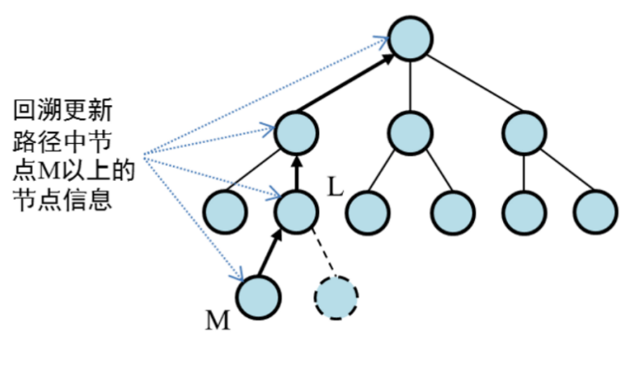

# 黑白棋-程序报告

<center>
    王开炫 夏裕诚 黄雨欣
</center>

## 问题描述

黑白棋 (Reversi)，又称翻转棋，是一个经典的策略性游戏。
一般棋子双面为黑白两色，故称“黑白棋”。因为行棋之时将对方棋子翻转，则变为己方棋子，故又称“翻转棋”(Reversi) 。
黑白棋使用 8x8 大小的棋盘，由两人执黑子和白子轮流下棋，最后子多方为胜方。

### 黑白棋规则

1. 黑方先行，双方交替下棋。
2. 一步合法的棋步包括：
(a) 在一个空格处落下一个棋子，并且翻转对手一个或多个棋子；
(b) 新落下的棋子必须落在可夹住对方棋子的位置上，对方被夹住的所有棋子都要翻转过来，可以是横着夹，竖着夹，或是斜着夹。夹住的位置上必须全部是对手的棋子，不能有空格；
(c) 一步棋可以在数个（横向，纵向，对角线）方向上翻棋，任何被夹住的棋子都必须被翻转过来，棋手无权选择不去翻某个棋子。
3. 如果一方没有合法棋步，也就是说不管他下到哪里，都不能至少翻转对手的一个棋子，那他这一轮只能弃权，而由他的对手继续落子直到他有合法棋步可下。
4. 如果一方至少有一步合法棋步可下，他就必须落子，不得弃权。
5. 棋局持续下去，直到棋盘填满或者双方都无合法棋步可下。
6. 如果某一方落子时间超过 1 分钟或者连续落子 3 次不合法，则判该方失败。

### 任务

使用 Python 算法实现MCTS(Monte Carlo Tree Search, 即蒙特卡洛树搜搜) 实现 MiniAlphaGo for Reversi, 并提供简单的图形界面用于人机博弈交互。

## 算法描述

### 蒙特卡洛树搜索

对搜索算法进行优化以提高搜索效率基本上是在解决如下两个问题：优先扩展哪些节点以及放弃扩展哪些节点，综合来看也可以概括为如何高效地扩展搜索树。如果将目标稍微降低，改为求解一个近似最优解，则上述问题可以看成是如下探索性问题：算法从根节点开始，每一步动作为选择（在非叶子节点）或扩展（在叶子节点）一个子节点。可以用执行该动作后所收获奖励来判断该动作优劣。奖励可以根据从当前节点出发到达目标路径的代价或游戏终局分数来定义。算法会倾向于扩展获得奖励较高的节点。算法事先不知道每个节点将会得到怎样的代价（或终局分数）分布，只能通过采样式探索来得到计算奖励的样本。由于这个算法利用蒙特卡洛法通过采样来估计每个动作优劣，因此它被称为蒙特卡洛树搜索（Monte-Carlo Tree Search）算法[Kocsis 2006]。

#### 选择(Selection)


算法从搜索树的根节点开始，向下递归选择子节点，直至到达叶子节点或者到达具有还未被扩展过的子节点的节点 L。 这个向下递归选择过程可由 UCB 算法来实现，在递归选择过程中记录下每个节点被选择次数和每个节点得到的奖励均值。
我们将节点分成三类：

* 未访问：还没有评估过当前局面
* 未完全展开：被评估过至少一次，但是子节点（下一步的局面）没有被全部访问过，可以进一步扩展
* 完全展开：子节点被全部访问过

基于双方玩家都是理性人的假设，我们找到目前认为最有可能会走到的一个未被评估的局面，并且选择它。什么节点最有可能走到呢？最直观的想法是直接看节点的胜率（赢的次数/访问次数），哪个节点最大选择哪个，但是这样是不行的！因为如果一开始在某个节点进行模拟的时候，尽管这个节点不怎么好，但是一开始随机走子的时候赢了一盘，就会一直走这个节点了。
$$
UCT(v_i, v) = \frac{Q(v_i)}{N(v_i)}+c\sqrt{\frac{\log N(v)}{N(v_i)}}
$$
其中$Q(v)$是该节点赢，$N(v)$是该节点模拟的次数，C 是一个常数。因此我们每次选择的过程如下——从根节点出发，遵循最大最小原则，每次选择己方 UCT 值最优的一个节点，向下搜索，直到找到一个**未完全展开的节点**，根据我们上面的定义，未完全展开的节点一定有未访问的子节点，随机选一个进行扩展。

#### 扩展(Expansion)


如果节点 L 不是一个终止节点（或对抗搜索的终局节点），则随机扩展它的一个未被扩展过的后继边缘节点 M。

#### 模拟(Simulation)


从节点 M 出发，模拟扩展搜索树，直到找到一个终止节点。模拟过程使用的策略和采用 UCB 算法实现的选择过程并不相同，前者通常会使用比较简单的策略，例如使用随机策略。

#### 反向传播(Back Propagation)



用模拟所得结果（终止节点的代价或游戏终局分数）回溯更新模拟路径中 M 以上（含M）节点的奖励均值和被访问次数。

### 传统黑白棋策略

在这里我们简要概括传统黑白棋游戏的策略。

1. 贪心策略
每一步走子都选择使得棋盘上子最多的一步，而不考虑最终的胜负；

2. 确定子策略
某些子一旦落子后就再也不会被翻回对方的子，最典型的是四个角上的子，这类子被称为确定子 (Stable Discs)。每一步走子都选择使得棋盘上己方的确定子最多的一步。
3. 位置优先策略
考虑到角点的重要性，把棋盘上的每一个子都赋予一个优先级，每一步从可走子里选择优先级最高的一个子。
4. 机动性策略 (mobility)
黑白棋每一步的可走子都是有限的，机动性策略是指走子使得对手的可走子较少，从而逼迫对手不得不走出差的一步 (bad move)，使得自己占据先机。
5. 消失策略 (evaporation, less is more)
在棋盘比试的前期，己方的子越少往往意味着局势更优。因此在前期可采用使己方的子更少的走子。
6. 奇偶策略 (parity)
走子尽量走在一行或一列有奇数个空子的位置。以上只列举了一些常见的黑白棋策略或原则，事实上还有很多更为复杂的策略，此处不进行列举。

首先我们实现贪心策略，但发现由于过于短视其效果十分不理想，往往陷入局部最优而无法致胜。考虑实现的简单性，我们选择了位置优先策略进行实现，具体的优先级如下（参考了Roxanne策略）:


优先级这样指定的主要原因是角、边不容易被吃子，而其他位置容易被吃。同时综合考虑了限制对手行动力、扩大自己稳定子，得出的上文的优先级。我们这里将这种优先级的做法用于我们模拟的过程。

## 代码

### `game.py`

在 `game.py` 中，我们新创建一个类 `SimulationGame`, 它的实现方式基本和 `Game` 相同，主要用于蒙特卡洛树搜索中模拟部分。当我们要模拟后续结果时，就可以直接通过调用 `SimulationGame.run()` 得到答案。代码如下：

```python
class SimulateGame(object):
    """
    For simulation testing.
    """

    def __init__(self, black_player, white_player, board = Board(), current_player = None):
        self.board = deepcopy(board)
        self.black_player = black_player
        self.white_player = white_player
        self.black_player.color = "X"
        self.white_player.color = "O"
        self.current_player = current_player

    def switch_player(self, black_player, white_player):
        """
        游戏过程中切换玩家
        :param black_player: 黑棋
        :param white_player: 白棋
        :return: 当前玩家
        """
        # 如果当前玩家是 None 或者 白棋一方 white_player，则返回 黑棋一方 black_player;
        if self.current_player is None:
            return black_player
        else:
            # 如果当前玩家是黑棋一方 black_player 则返回 白棋一方 white_player
            if self.current_player == self.black_player:
                return white_player
            else:
                return black_player

    def print_winner(self, winner):
        """
        打印赢家
        :param winner: [0,1,2] 分别代表黑棋获胜、白棋获胜、平局3种可能。
        :return:
        """
        print(['黑棋获胜!', '白棋获胜!', '平局'][winner])

    def force_loss(self, is_timeout=False, is_board=False, is_legal=False):
        """
         落子3个不合符规则和超时则结束游戏,修改棋盘也是输
        :param is_timeout: 时间是否超时，默认不超时
        :param is_board: 是否修改棋盘
        :param is_legal: 落子是否合法
        :return: 赢家（0,1）,棋子差 0
        """

        if self.current_player == self.black_player:
            win_color = '白棋 - O'
            loss_color = '黑棋 - X'
            winner = 1
        else:
            win_color = '黑棋 - X'
            loss_color = '白棋 - O'
            winner = 0

        if is_timeout:
            print('\n{} 思考超过 60s, {} 胜'.format(loss_color, win_color))
        if is_legal:
            print('\n{} 落子 3 次不符合规则,故 {} 胜'.format(loss_color, win_color))
        if is_board:
            print('\n{} 擅自改动棋盘判输,故 {} 胜'.format(loss_color, win_color))

        diff = 0

        return winner, diff

    def run(self):
                # 定义统计双方下棋时间
        total_time = {"X": 0, "O": 0}
        # 定义双方每一步下棋时间
        step_time = {"X": 0, "O": 0}
        # 初始化胜负结果和棋子差
        winner = None
        diff = -1

        # 游戏开始
        # print('\n=====开始游戏!=====\n')
        # 棋盘初始化
        # self.board.display(step_time, total_time)
        while True:
            # 切换当前玩家,如果当前玩家是 None 或者白棋 white_player，则返回黑棋 black_player;
            #  否则返回 white_player。
            self.current_player = self.switch_player(self.black_player, self.white_player)
            start_time = datetime.datetime.now()
            # 当前玩家对棋盘进行思考后，得到落子位置
            # 判断当前下棋方
            color = "X" if self.current_player == self.black_player else "O"
            # 获取当前下棋方合法落子位置
            legal_actions = list(self.board.get_legal_actions(color))
            # print("%s合法落子坐标列表："%color,legal_actions)
            if len(legal_actions) == 0:
                # 判断游戏是否结束
                if self.game_over():
                    # 游戏结束，双方都没有合法位置
                    winner, diff = self.board.get_winner()  # 得到赢家 0,1,2
                    break
                else:
                    # 另一方有合法位置,切换下棋方
                    continue

            board = deepcopy(self.board._board)
            action = self.current_player.get_move(self.board)
            if action is None:
                continue
            else:
                self.board._move(action, color)
                if self.game_over():
                    winner, diff = self.board.get_winner()
                    break

            return winner, diff
        
    def game_over(self):
        """
        判断游戏是否结束
        :return: True/False 游戏结束/游戏没有结束
        """

        # 根据当前棋盘，判断棋局是否终止
        # 如果当前选手没有合法下棋的位子，则切换选手；如果另外一个选手也没有合法的下棋位置，则比赛停止。
        b_list = list(self.board.get_legal_actions('X'))
        w_list = list(self.board.get_legal_actions('O'))

        is_over = len(b_list) == 0 and len(w_list) == 0  # 返回值 True/False

        return is_over
```

### `PosFirstPlayer.py`

在初始化时我们将位置按照优先级归类，并共同构成一个 list. 当需要落子时，我们按照优先级从低到高的顺序依次迭代，如果能在高优先级中找到一个可以落子的位置，我们就直接落子于此。否则继续遍历较低的优先级，直到能够落子或者遍历结束无子可下为止。

```python
import random

class PosFirstPlayer(object):
    """
    采用位置优先策略。
    """

    def __init__(self, color):
        self.roxanne_table =  [
            ['A1', 'H1', 'A8', 'H8'],
            ['C3', 'F3', 'C6', 'F6'],
            ['C4', 'F4', 'C5', 'F5', 'D3', 'E3', 'D6', 'E6'],
            ['A3', 'H3', 'A6', 'H6', 'C1', 'F1', 'C8', 'F8'],
            ['A4', 'H4', 'A5', 'H5', 'D1', 'E1', 'D8', 'E8'],
            ['B3', 'G3', 'B6', 'G6', 'C2', 'F2', 'C7', 'F7'],
            ['B4', 'G4', 'B5', 'G5', 'D2', 'E2', 'D7', 'E7'],
            ['B2', 'G2', 'B7', 'G7'], 
            ['A2', 'H2', 'A7', 'H7', 'B1', 'G1', 'B8', 'G8']
        ]
        self.color = color

    def select(self, board):
        """
        根据当前棋盘状态选择最佳落子位置
        :param board: 棋盘
        :return: action 最佳落子位置, e.g. 'A1'
        按照优先级从低到高的顺序依次迭代，如果能在高优先级中找到一个可以落子的位置，
        我们就直接落子于此。否则继续遍历较低的优先级，直到能够落子或者遍历结束无子可下为止。
        """
        action_list = list(board.get_legal_actions(self.color))
        if len(action_list) == 0:
            print("PosFirstPlayer 无子可下，跳过回合")
            return None
        for move_list in self.roxanne_table:
            random.shuffle(move_list)
            for move in move_list:
                if move in action_list:
                    return move

    def get_move(self, board):
        """
        根据当前棋盘状态获取最佳落子位置
        :param board: 棋盘
        :return: action 最佳落子位置, e.g. 'A1'
        """
        if self.color == 'X':
            player_name = '黑棋'
        else:
            player_name = '白棋'
        print("请等一会，PosFirstPlayer {}-{} 正在思考中...".format(player_name, self.color))
        action = self.select(board)
        return action
    
```

### 蒙特卡洛树

#### 成员变量

在蒙特卡洛搜索树构建时，我们需要 N(记录目前模拟比赛次数), Q(记录目前模拟比赛胜利次数), parent(记录当前节点的上一节点，即从哪个节点更新过来的，这个属性在反向传播中用到), color(目前状态到下一状态需要放置什么颜色的棋子), child(记录有哪些后继节点). 对应初始化代码如下：

```python
class MCT:

    def __init__(self, color, parent = None):
        self.N = 0 # total number of games
        self.Q = 0 # total number of winned games
        self.parent = parent
        self.color = color
        self.children = dict() # key: 落子位置, value: reference to an MCT instance
```

#### helper method：下一次扩展时的颜色

当我们在扩展时，我们需要更新当前节点的后继。而当前节点的后继的 color 属性应该和当前节点相反，因此我们使用 `oppo` 方法来实现。

```python
def oppo(self):
    """
    Return a opposite color w.r.t. self.color
    """
    return "X" if self.color == "O" else "O"
```

#### UCB

由前文的分析可知，选择一个节点的依据是UCB值，在这里我们给出UCB值的计算函数。

```python
def UCB(self):
    """
    Upper Confidence Bound. Details in the report.
    :return: UCT value
    """
    return self.Q / self.N + 2 * sqrt(2 * log(self.parent.N) / self.N)
```

### 蒙特卡洛树搜索

我们单独实现了一个类来完成蒙特卡洛树搜索的过程。

#### 成员变量

对一个 MCTS 类，我们只需要两个属性 simulate_black 和 simulate_white. 它们都是采用位置优先策略的玩家的实例，在蒙特卡洛树搜索中模拟双方进行比赛。

```python
from PosFirstPlayer import PosFirstPlayer
from MCT import MCT
from game import SimulateGame
from board import Board
from copy import deepcopy
import time

class MCTS:
    """
    Monte Carlo Tree Search
    """
    
    def __init__(self):
    self.simulate_black = PosFirstPlayer('X')
    self.simulate_white = PosFirstPlayer('O')
    self.begin_time = time.time()
```

#### `UCTSearch()`

每次决策都要执行 UCTSearch 来为我们这步下在哪里提供信息。UCTSearch 的过程和蒙特卡洛树的过程相同，从根节点出发，首先调用 Select 函数选出目前最有可能获胜的方法，并将这个点进行扩展，随后利用 SimulatePolicy 进行模拟比赛，得到结果后算出选出的点的分数，并最后通过 BackPropagte 进行反向传播。
需要注意的是在模拟出答案后，正如前文所说 v.color 表示的是 v 这个状态将要放的颜色，也就是说 v 是处于 oppo(color) 这个颜色，因此在得到答案后我们需要 16 到 18 行的代码进行调整。
此外我们在最开始设置了循环，并读取时间，以保证每次落子的搜索时间不会超过 59 秒。

```python
def UCTSearch(self, root, board):
    while time.time() - self.begin_time < 59: # prevent longer search time
        board_saved = deepcopy(board)
        v_select = self.select(root, board_saved)
        self.expand(v_select, board_saved)
        winner, diff = self.simulate_policy(v_select, board_saved)

        if winner == 2:
            score = 0.5
        elif winner == 0:
            score = 1
        else:
            score = 0

        if v_select.color == 'X':
            score = 1 - score
        self.backprop(v_select, score)
```

#### `select()`

对当前节点的后继，我们找到其中 UCB 值最大的后继并进行进一步的搜索直到叶子节点。需要注意的是如果存在叶子节点没有进行过模拟比赛，那么我们直接选择这个节点，避免出现一直选择某几种方法，一开始就走错了路，但其他节点从未被选过的情况。

```python
def select(self, node : MCT, board : Board):
    
    max_UCB = -5636
    choice = None
    if len(node.children) == 0:
        return node
    for i in node.children.keys():
        child = node.children[i]
        if child.N <= 1:
            choice = i
            break
        else:
            temp = child.UCB()
            if temp > max_UCB:
                max_UCB = temp
                choice = i

    board._move(choice, node.color)
    return self.select(node.children[choice], board)
```

#### `expand()`

对于当前状态，所有下一步能下的点都作为可能的后继状态，我们都在搜索树中创造其对应的实例

```python
def expand(self, node, board):
    children = board.get_legal_actions(node.color)
    for i in children:
        node.children[i] = MCT(node.oppo(), node)
```

#### `simulate_policy()`

假定两个都采用位置优先策略的玩家进行模拟比赛，并将结果返回。

```python
def simulate_policy(self, node, board : Board):
    """
    Simulate using self defined SimualteGame
    """

    current_player = self.simulate_white if node.color == 'X' else self.simulate_black
    return SimulateGame(self.simulate_black, self.simulate_white, board, current_player).run()
```

#### `backprop()`

从当前叶子节点开始，沿着 `v.parent` 不断向上更新总局数和胜利次数。

```python
def backprop(self, node, score):
    v = node
    while v is not None:
        v.Q += score
        v.N += 1
        v = v.parent
        score = 1 - score
```

### `AIPlayer()`

每次决策我们先建一个根节点表示当前状态，随后就调用 UCTSearch 方法进行蒙特卡洛树搜索，结束后我们检查哪个后继状态走的最多，最后选择那个状态并落子。
需要注意的是，之所以走的越多的状态就是我们认为的最佳选择，是因为蒙特卡洛树搜索算法的核心就是，越好的节点，越有可能走，反过来就是，走得越多的节点就越好。

```python
from MCT import MCT·
from MCTS import MCTS
from PosFirstPlayer import PosFirstPlayer
from copy import deepcopy

class AIPlayer:
    """
    AI 玩家
    """
def __init__(self, color):
    """
    玩家初始化
    :param color: 下棋方，'X' - 黑棋，'O' - 白棋
    """

    self.color = color

def get_move(self, board):
    """
    根据当前棋盘状态获取最佳落子位置
    :param board: 棋盘
    :return: action 最佳落子位置, e.g. 'A1'
    """
    if self.color == 'X':
        player_name = '黑棋'
    else:
        player_name = '白棋'
    print("请等一会，对方 {}-{} 正在思考中...".format(player_name, self.color))

    # -----------------请实现你的算法代码--------------------------------------
    mcts = MCTS()
    root = MCT(color=self.color)
    mcts.UCTSearch(root, deepcopy(board))
    print('here')
    choice = root
    max_N = -5636
    for i in root.children.keys():
        child = root.children[i]
        if child.N > max_N:
            max_N = child.N
            choice = i
    action = choice
    print(action)
    # ------------------------------------------------------------------------

    return action
```